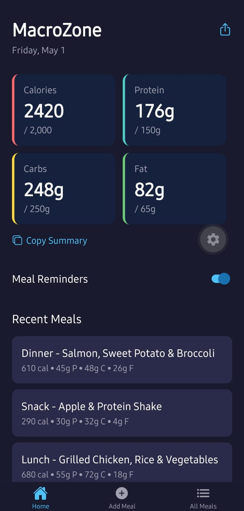
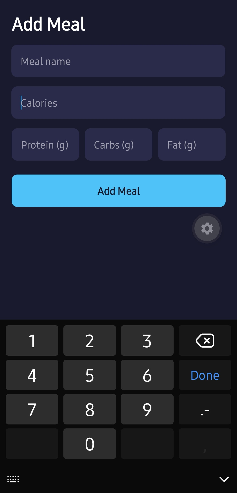
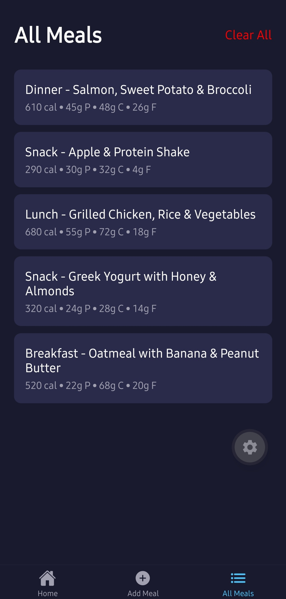

# MacroZone

<div align="center">
  
  
  <h3>Modern Macronutrient & Meal Tracking Application</h3>
  
  <p>
    A high-performance React Native mobile application built with Expo to seamlessly track daily nutrition, log meals, and manage dietary goals. 
  </p>
</div>

---

## 📖 Overview

**MacroZone** is a robust mobile application designed to simplify daily nutritional tracking. Developed with modern React Native and Expo infrastructure, it provides users with an intuitive interface for logging meals, monitoring macronutrients (Proteins, Carbohydrates, and Fats), and persisting user data securely on the device.

This project showcases expertise in building production-ready mobile applications, utilizing state-of-the-art libraries for routing, animations, and local storage.

### 📱 App Previews

<div align="center">
  
  
  
  <br/>
  <p><i>Left to right: <strong>Dashboard</strong> tracking daily goals, <strong>Add Meal</strong> flow, and <strong>Meals List</strong> history view. <br>(Replace these placeholders with actual screenshots from the app!)</i></p>
</div>

## ✨ Key Features

- **Intuitive Meal Logging**: Quickly add and categorize meals with a streamlined user interface.
- **Macronutrient Dashboard**: Visualize daily intake of calories, proteins, carbs, and fats.
- **File-Based Routing**: Clean and scalable navigation managed entirely via Expo Router.
- **Local Persistence**: Offline-first architecture using `@react-native-async-storage/async-storage`.
- **Smooth Animations**: High-performance UI interactions powered by `react-native-reanimated`.
- **Native Integrations**: Utilizes device features like Haptic Feedback (`expo-haptics`) for an enhanced user experience.

## 🛠 Tech Stack

- **Framework**: [React Native](https://reactnative.dev/)
- **Toolchain**: [Expo](https://expo.dev/) (SDK 55)
- **Language**: [TypeScript](https://www.typescriptlang.org/)
- **Navigation**: [Expo Router](https://docs.expo.dev/router/introduction/)
- **Animations**: [React Native Reanimated](https://docs.swmansion.com/react-native-reanimated/)
- **Storage**: [AsyncStorage](https://react-native-async-storage.github.io/async-storage/)

## 📂 Project Structure

```text
macrozone/
├── src/
│   ├── app/           # Expo Router file-based routing
│   │   ├── (tabs)/    # Bottom tab navigation screens
│   │   └── components/# Reusable UI components
│   ├── storage/       # AsyncStorage utilities and data models
│   ├── styles/        # Global theming and styling configuration
│   └── utils/         # Helper functions and business logic
├── assets/            # Static assets (images, icons, fonts)
├── app.json           # Expo configuration
└── package.json       # Project dependencies and scripts
```

## 🚀 Getting Started

Follow these instructions to get a copy of the project up and running on your local machine.

### Prerequisites

- Node.js (v18 or higher)
- npm or yarn
- Expo Go app on your physical device, or an iOS Simulator / Android Emulator

### Installation

1. Clone the repository:
   ```bash
   git clone https://github.com/Mohamed-Boutarbouch/macrozone_react_native_expo_app.git
   cd macrozone
   ```

2. Install dependencies:
   ```bash
   npm install
   ```

3. Start the development server:
   ```bash
   npx expo start
   ```

4. Open the app:
   - Scan the QR code in your terminal using the **Expo Go** app on your phone.
   - Or press `i` to open in the iOS simulator.
   - Or press `a` to open in the Android emulator.

## 💡 Architecture & Design Decisions

- **Offline-First & Local Persistence**: By utilizing `AsyncStorage`, the application provides an offline-first experience. Users can log meals and view their history instantaneously without relying on network latency or an active internet connection. This guarantees a snappy, reliable user experience and serves as an excellent foundation before migrating to a cloud database.
- **File-Based Routing System**: Transitioning from traditional component-based routing, the app leverages **Expo Router** to automatically map the file system to navigation routes. This significantly reduces boilerplate, enforces a clean project structure, and provides deep linking capabilities out of the box.
- **60fps UI Animations**: To ensure the app feels premium and native, **React Native Reanimated** was chosen over standard React Native animations. Reanimated offloads animation logic to the UI thread, bypassing the JavaScript thread to maintain a buttery smooth 60 frames per second, even during complex transitions.
- **Strict Type Safety**: The entire codebase is built with strict **TypeScript** configurations. This design choice dramatically reduces runtime errors, documents expected data structures directly within the code, and greatly improves long-term code maintainability.
- **Component-Driven Design**: The UI architecture follows the Single Responsibility Principle, broken down into atomic, highly reusable components. This modularity ensures that style updates or logical changes are isolated, making the application highly scalable for future feature additions.
